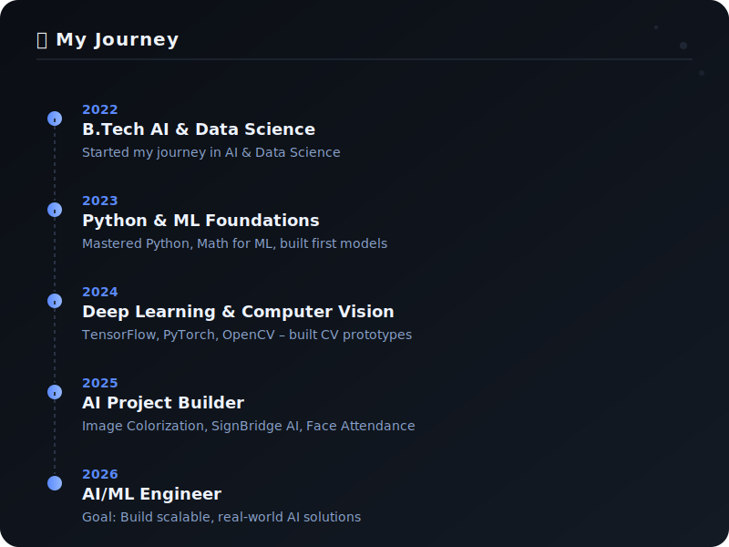
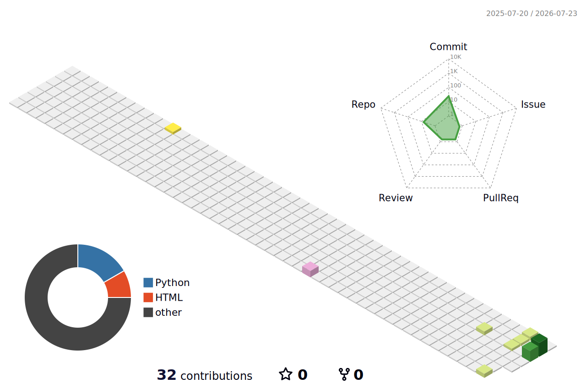

# Hi 👋, I'm Balaji S

### AI & Data Science Student | Python Developer | AI Enthusiast

  
  
  
  

  
  
  

## 👨‍💻 About Me

🎓 Second Year B.Tech Artificial Intelligence & Data Science Student

💻 Passionate Python Developer

🤖 Interested in Artificial Intelligence, Machine Learning and Deep Learning

👁️ Exploring Computer Vision & Generative AI

🚀 Building Real-World AI Applications

📍 Tamil Nadu, India

---

## 🖥️ Who Am I

  

---

## 🛠️ Tech Stack

  

  

---

## 💼 Journey

  

---

## 🎓 Education & Certifications

### 🎓 Education
- **B.Tech – Artificial Intelligence & Data Science** (Second Year)
- **Location:** Tamil Nadu, India

### 🏅 Certifications
- Python Programming
- Machine Learning Fundamentals
- AI & Data Science
- Git & GitHub

---

## 🌱 Currently Learning

- Deep Learning
- Computer Vision
- Generative AI
- LangChain
- OpenAI API
- Streamlit
- Data Structures & Algorithms

---

## 🚀 Featured AI Projects

| Project | Description | Technology |
| :--- | :--- | :--- |
| 🎨 **Image Colorization** | Convert Black & White images into realistic color images | Deep Learning, OpenCV, Python |
| 🤟 **SignBridge AI** | Two-Way Sign Language Communication System | 3D Avatar, CNN, NLP |
| 😀 **Face Attendance System** | AI-powered attendance system using facial recognition | OpenCV, Python |
| 🚗 **Vehicle Detection** | Vehicle counting and tracking system | YOLO, OpenCV |
| 📊 **Student Performance Prediction** | Machine Learning predictive analytics model | Scikit-Learn, Python |

---

## 📈 GitHub Analytics

  
  

 

  

 

  

---

## 🏆 Achievements

  

---

## 🧊 3D Contribution Graph

  

---

## 🐍 Contribution Snake

  

---

## 💡 Quote

> *"Artificial Intelligence is not replacing humans—it empowers those who know how to use it."*

---

## 📬 Connect With Me

  
  

 

### ⭐ Thanks for visiting my profile! ⭐

